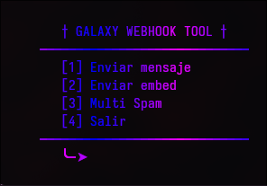

### Galaxy WebhookSpammer

## 🔗**Descripcion**: 
- _Esta herramienta sirve para hacer spam con webhooks  a servidores de discord, ya sea con un solo webhook o multiples, haciendo que sea mas eficiente. **Nota**: ningun miembro de **Galaxy** ni azkeel se hace responsable por el mal uso de esta herramienta._

## 📕**Caracteristicas**:
- **Funcion multi spam.**
- **Spam en un solo webhook.**
- **Spam en con embeds.**
- **Menu de opciones.**
- **Pausas automáticas para evitar bloqueos al exceder las tasas de solicitudes.**
- **Spam personaliado.**
## 📜**Requisitos**  
- Python 3.x  
- Librerias: `Discord-Webhook`, `pystyle`).

## ⚠️**Advertencia**:
- El uso no autorizado de este script para dañar o alterar servidores sin el consentimiento del propietario es ilegal y contrario a los términos de servicio de Discord. Usa este código bajo tu propia responsabilidad.

#### 📥 **Únete a nuestro Discord**  
Para soporte o consultas, únete a nuestro servidor oficial:  
🔗 [Servidor de Discord](https://discord.gg/3W2xBRnB3k)  
